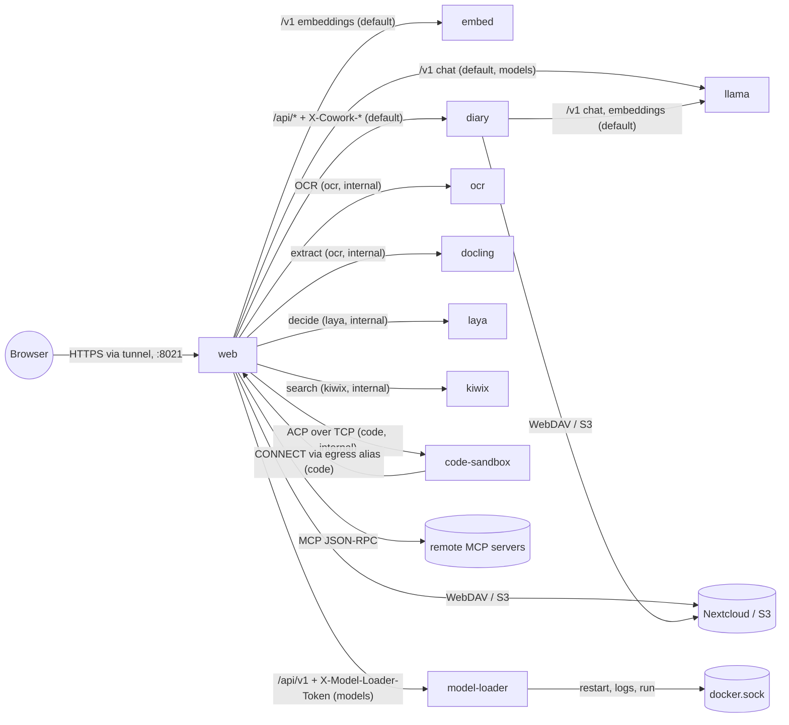
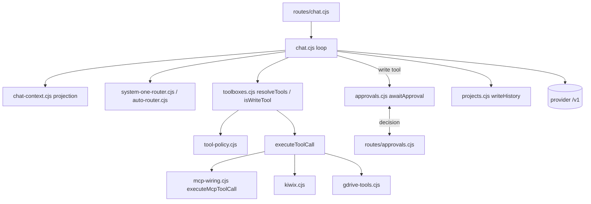

# Service boundaries and migration contracts — spec

Issue [#267](https://github.com/sbstndalton/noevia/issues/267), roadmap "Later — modular
platform", workstream 1. Written 2026-09-25 from `main` at `a6663cc`. **Status: proposed, not
reviewed.** This document maps what exists, names the seams and proposes contracts. It does not
move code, change a Compose file, or authorise any routing, provider or model-lifecycle change
(see [§9](#9-what-this-does-not-authorise)).

Every architectural claim cites a file. The code was read for this document, but no server was
reachable from the session that wrote it: anything that depends on the live DaServer
configuration (the Compose Manager copy, `.env`, which overlays are active) is marked
**[live: verify]** and has a matching check in [Appendix A](#appendix-a--live-verification-on-daserver).
The agent brief warns that its architecture notes are not a release snapshot
([agent-brief.md](agent-brief.md)); where this document and the brief disagree, the code cited
here wins until the appendix is run.

Diagrams are Mermaid. No other file in `docs/` uses Mermaid yet; GitHub renders it, and each
diagram is repeated as a table so the document still reads where Mermaid does not.

## Contents

1. [Summary of conclusions](#1-summary-of-conclusions)
2. [Current topology](#2-current-topology)
3. [Dependency and data-flow map](#3-dependency-and-data-flow-map)
   1. [Web process: mounts and their order](#31-web-process-mounts-and-their-order)
   2. [Core orchestration](#32-core-orchestration)
   3. [Inference and the model manager](#33-inference-and-the-model-manager)
   4. [MCP](#34-mcp)
   5. [Diary sidecar](#35-diary-sidecar)
   6. [Stateless and sandbox sidecars](#36-stateless-and-sandbox-sidecars)
   7. [Storage (WebDAV/S3)](#37-storage-webdavs3)
   8. [Auth, sessions and CSRF](#38-auth-sessions-and-csrf)
   9. [Secrets and `.env` ownership](#39-secrets-and-env-ownership)
   10. [Per-tenant state on disk](#310-per-tenant-state-on-disk)
4. [Extraction seams and verdicts](#4-extraction-seams-and-verdicts)
5. [Versioned internal API and compatibility contracts](#5-versioned-internal-api-and-compatibility-contracts)
6. [Migration plans](#6-migration-plans)
7. [Findings the map surfaced](#7-findings-the-map-surfaced)
8. [Recommendations for #268–#271](#8-recommendations-for-268271)
9. [What this does not authorise](#9-what-this-does-not-authorise)
- [Appendix A — live verification on DaServer](#appendix-a--live-verification-on-daserver)

## 1. Summary of conclusions

- **The web process is already the core.** `apps/web/server/index.cjs` hosts the browser API,
  the chat loop, approvals, tool policy, MCP wiring, auth, secrets, the job store, the code-egress
  proxy, the DAV listener and noevia's own MCP listener. Tenant scope is an in-process
  `AsyncLocalStorage` (`requestScope`, `index.cjs`), and the approval gate is an in-memory map
  (`approvals.cjs`). Those two facts decide most verdicts: anything that needs tenant scope or
  approval state is cheapest and safest in the same process.
- **Every existing sidecar already sits on a real boundary**: a device (llama.cpp, the GPU), the
  Docker socket (model-loader), untrusted file parsing with resource caps (OCR, Docling), untrusted
  code (code-sandbox), a different runtime and irreplaceable state (Diary), or a separate model
  (Laya, embed). None of them should be merged back.
- **No new container is justified by the code today**, with one exception: the browser executor
  launches Chromium *inside the web process* — `index.cjs` passes a `launch` that calls
  `playwright.chromium.launch` into `browser-service.cjs` — whenever the operator has installed
  Playwright (an operator-installed module, not a package dependency). If it is ever enabled it
  needs the same sandbox treatment as Code mode. That is a boundary the code demonstrates.
- **The weakest existing contract is web → Diary.** The sidecar trusts `X-Cowork-User-ID` from any
  holder of one shared token, `DIARY_AUTH_TOKEN` may be empty (open mode), and each request carries
  the tenant's *decrypted* storage credential in `X-Cowork-Storage` (`diary.cjs`,
  `services/diary/agent/app.py`). Any Diary extraction or repository move (#271) should first
  harden this contract, not change the process layout.
- **One state file has two writers**: `models.ini` is written by the web process
  (`llamacpp-presets.cjs`) and by model-loader (`PUT /api/v1/sections/{name}`,
  `services/model-manager/app/api.py`). Any inference/model-lifecycle work (#269) should pick one
  owner before it picks a process boundary.

Per-seam verdicts are in [§4](#4-extraction-seams-and-verdicts); the four issue recommendations
are in [§8](#8-recommendations-for-268271).

## 2. Current topology

Base stack: `compose.yaml` (web, diary, ocr, laya under a profile). Overlays:
`compose.llamacpp.yaml` (llama, model-loader, the `models` network), `compose.docling.yaml`
(docling), `deploy/examples/kiwix.override.yml` (kiwix), `deploy/examples/code-sandbox.override.yml`
(code-sandbox, the `code` network). The live `embed` service exists only in the live Compose
Manager override (recorded in [deployment.md](deployment.md), "Release ea57c83"); no repo file
defines it **[live: verify]**. The live Compose Manager project also has a
`docker-compose.override.yml` attaching the external `lemonade_default` network
([deployment.md](deployment.md) "Three copies of the compose config"); its members are not in any
repo file **[live: verify]** (Appendix A2). The roadmap lists ten live containers ([roadmap.md](roadmap.md),
"Where things stand").



Edge labels name the network each hop uses. The table below is authoritative for network
membership (a Mermaid node can sit in only one subgraph, so the diagram does not draw networks).

| Service | Image and pin | Networks | Published port | Privilege or resource boundary | Defined in |
| --- | --- | --- | --- | --- | --- |
| web | `cowork-web:${COWORK_VERSION}` | default, ocr, laya; +models, kiwix, code via overlays | `${COWORK_PORT:-8021}:8021` | Holds all account state and secrets | `compose.yaml`, overlays |
| diary | `cowork-diary:${DIARY_VERSION:?}` | default | none (`expose: 8010`) | Python runtime, irreplaceable corpus state | `compose.yaml` |
| ocr | `cowork-ocr:${OCR_VERSION:?}` | ocr (internal) | none | read-only root, `cap_drop: ALL`, 1 GiB, 64 pids | `compose.yaml` |
| laya | `cowork-laya:0.3.5-noevia1` | laya (internal) | none | read-only, uid 1000, 6 GiB, own model | `compose.yaml` (profile `laya`) |
| llama | llama.cpp Vulkan, digest-pinned | default, models | none | GPU render/card devices, 14 GiB | `compose.llamacpp.yaml` |
| model-loader | `cowork-model-loader:${MODEL_MANAGER_VERSION:?}` | models only | none | `/var/run/docker.sock`, token-gated | `compose.llamacpp.yaml` |
| docling | `cowork-docling:${DOCLING_VERSION}` | ocr (internal) | none | read-only, offline models, 6 GiB | `compose.docling.yaml` |
| kiwix | `kiwix-serve:3.7.0` | kiwix (internal) | none | read-only ZIMs | `deploy/examples/kiwix.override.yml` |
| code-sandbox | `cowork-code-sandbox:${CODE_SANDBOX_VERSION}` | code (internal) | none | read-only, uid 1000, `cap_drop: ALL`, 3 GiB | `deploy/examples/code-sandbox.override.yml` |
| embed | pinned llama.cpp, CPU | default | none | CPU-only embedding model | live override only **[live: verify]** |

## 3. Dependency and data-flow map

### 3.1 Web process: mounts and their order

`handleRequest` (`index.cjs`) first takes the inference maintenance gate for non-GET `/api/chat`
and `/api/diary/*` (`modelManager.enterInference`), then `handleRequestInner` authenticates once,
loads the workspace and runs everything inside `requestScope.run({ workspace, authn })`.
`handleRequestScoped` then applies security headers and mounts, in this order:

| # | Mount (factory file) | Auth position | Calls into |
| --- | --- | --- | --- |
| 1 | `publicPage` (`routes/public-pages.cjs`) | before session | static text |
| 2 | `diaryRoutes.connector` (`routes/diary.cjs`) — `POST /api/diary-connector` | before session; own credential (`diary-connectors.cjs`) | `diary.cjs` → Diary sidecar |
| 3 | `webAddressRoutes` for `/api/instance`, `/.well-known/webauthn` (`routes/web-address.cjs`) | before session | `auth.cjs` |
| 4 | `authRoutes.open` (`routes/auth.cjs`) — the `publicAuthRoutes` set | before session; Origin checked on writes | `auth.cjs`, `secrets.cjs` |
| — | **Session gate**: `/api/*` not in `publicAuthRoutes` needs `authService.authenticate`; non-GET needs `originValid` and `csrfValid` | | `auth.cjs` |
| 5 | `featureRoutes` (`routes/features.cjs`) | session | `features.cjs`, `decision-settings.cjs` |
| 6 | `exportRoutes`, `importRoutes` (`routes/export.cjs`, `routes/import.cjs`) | session | `projects.cjs`, `chat-lists.cjs`, `conversation-import.cjs` |
| 7 | `accountRoutes` (`routes/account.cjs`) | session | `account-*.cjs`, `chat-retention.cjs` |
| 8 | `offsiteRoutes` (`routes/offsite-backup.cjs`) | session, admin | `offsite-service.cjs` |
| 9 | `connectorRoutes` (`routes/connectors.cjs`) | session | `drive-accounts.cjs`, `tool-policy.cjs` |
| 10 | `pluginDirectoryRoutes` (`routes/plugin-directory.cjs`) | session | two fixed public hosts |
| 11 | `mcpDirectoryRoutes` (`routes/mcp-directory.cjs`) | checks `authn` itself (OAuth callback) | `directory-mcp.cjs`, `mcp-oauth.cjs`, `mcp-wiring.cjs` |
| 12 | `webAddressRoutes` (admin part) | session, admin | `auth.cjs` |
| 13 | `researchRoutes`, `codeRoutes`, `browserRoutes` for `/api/projects/*` and `/api/code/active` | session, admin, feature flag | `research-service.cjs`, `code-service.cjs`, `browser-service.cjs` |
| 14 | `diaryRoutes.connectors` (`/api/profile/diary-connectors`) | session | `diary-connectors.cjs` |
| 15 | `projectRoutes` (`routes/projects.cjs`) | session | `projects.cjs`, `storage-client.cjs`, `documents.cjs`, `document-sources.cjs`, `rag.cjs`, `source-jobs.cjs` |
| 16 | `authRoutes.account` (profile, passkeys, sessions, `/api/admin/*`) | session | `auth.cjs`, `workspace.cjs`, Diary `DELETE /api/internal/tenant` |
| 17 | `storageRoutes` (`routes/storage.cjs`) | session | `storage-client.cjs`, `ssrf.cjs` |
| 18 | `approvalRoutes` (`routes/approvals.cjs`) | session | `approvals.cjs` |
| 19 | `toolboxRoutes` (`routes/toolboxes.cjs`) | session | `toolboxes.cjs`, `toolboxes-permitted.cjs`, `mcp-status.cjs` |
| 20 | `chatListRoutes` (`routes/chat-lists.cjs`) | session | `projects.cjs`, `chat-lists.cjs` |
| 21 | `providerRoutes` (`routes/providers.cjs`) | session (shared rows admin) | `providers.cjs`, `ssrf.cjs` |
| 22 | `usageRoutes` (`routes/usage.cjs`) | session | `usage.cjs`, `usage-summary.cjs` |
| 23 | `reasoningSettingsRoutes`, `samplingSettingsRoutes` | session | `reasoning-effort.cjs`, `sampling-presets.cjs` |
| 24 | `healthRoutes` (`routes/health.cjs`) | session | provider `/v1/models`, Diary `/api/health` |
| 25 | `modelRoutes` (`routes/models.cjs`) | session; `/api/model-manager/*` admin | `models.cjs`, `model-manager.cjs`, model-loader |
| 26 | `diaryRoutes.diary` (`/api/diary/*`) | session | `diary.cjs` → sidecar |
| 27 | `chatRoutes` (`routes/chat.cjs`) — `POST /api/chat` | session, rate limit | `chat.cjs`, `code-service.cjs` |
| 28 | Static files with SPA fallback (`static-files.cjs`) | none | `apps/web/dist` |

Additional listeners in the same process, started under `require.main === module` in `index.cjs`:

| Listener | Bind | Auth | File |
| --- | --- | --- | --- |
| Main UI/API | `UI_HOST:UI_PORT` (`0.0.0.0:8021`) | session cookie + CSRF | `index.cjs` |
| DAV file sharing | `COWORK_DAV_PORT` (default 0 = off) | per-user app passwords; `X-Cowork-Dav-Proxy-Token` behind HTTPS | `dav.cjs`, `dav-settings.cjs` |
| noevia's own MCP | `127.0.0.1:MCP_INTERNAL_PORT` (default 0 = off) | 30-second HMAC token from `secretStore.derive('mcp-internal-token')` | `mcp-internal.cjs`, `mcp-internal-tools.cjs` |
| Code egress proxy | `CODE_EGRESS_BIND:CODE_EGRESS_PORT` (default bind: web's own address on the `code` network, resolved at start via its `CODE_EGRESS_HOST` alias; loopback if that does not resolve; off unless the port is set) | per-task grant token | `code-egress.cjs` (`startEgressFromEnv`, `resolveEgressBind`) |

Background work in the same process: `offsiteBackup.schedule()` (`offsite-service.cjs`), the Diary
backup worker (`diary-backup-worker.cjs`, `POST /api/storage-backup` every 30 s per enabled
tenant), MCP discovery warm-up, calibration/autotune recovery and the model folder sync
(`model-folder-sync.cjs`).

### 3.2 Core orchestration

| Concern | Files | State | Crosses a process today? |
| --- | --- | --- | --- |
| Chat loop | `chat.cjs` (built by `createChatHandler` in `index.cjs`), `chat-turns.cjs`, `tool-exchange.cjs`, `prompt-framing.cjs` | transcripts via `projects.cjs` `writeHistory` | Yes, outbound only: provider `/v1/chat/completions` (180 s / 300 s `AbortSignal.timeout` in `chat.cjs`), Diary `/v1/chat/completions` stream (`diary-stream.cjs`) |
| Routing | `auto-router.cjs`, `system-one-router.cjs`, `decision-endpoint.cjs`, `decision-settings.cjs` | `decision-log.cjs` in `DATA_DIR` | Laya over `COWORK_DECISION_URL` (1.5 s default deadline, `decision-settings.cjs`) |
| Approvals | `approvals.cjs` (gate), `routes/approvals.cjs` (decision), waited on in `chat.cjs` | **memory only**; 5 min timeout, 1 h chat-wide TTL | No |
| Tool policy | `tool-policy.cjs` (allow/ask/block in `cowork.db`), `toolboxes.cjs` (`isWriteTool`, `resolveTools`, `toolCapFor`, `toolTokenBudgetFor`), `toolboxes-permitted.cjs` | `cowork.db` | No |
| Toolboxes | `toolboxes.cjs`, `mcp-boxes.cjs`, `mcp-toolbox-manifest.cjs`, `mcp-servers.cjs` (`ENABLED_TOOLBOXES`), `chat-tool-routing.cjs`, `chat-skill-routing.cjs` | derived | Embeddings for routing via `rag.embed` |
| Context projection | `chat-context.cjs`, `context-log.cjs`, `tool-result-reduce.cjs`, `prefill.cjs` ([spec-context-projection.md](spec-context-projection.md)) | derived; record never rewritten | Summariser calls go to the provider |
| Durable jobs | `jobs.cjs` (append-only events in the tenant directory, "callers run the work in-process"), `source-jobs.cjs`, `diary-jobs.cjs`, `code-service.cjs` | tenant dir | No |
| Retrieval | `rag.cjs` (sqlite-vec per project under `DATA_DIR/rag`) | files | Embedding endpoint (`EMBEDDING_BASE_URL` or the inference base) |
| Usage | `usage.cjs`, `usage-summary.cjs` | tenant dir | No |



Everything in this box shares `requestScope` and the approval maps. That is why [§4](#4-extraction-seams-and-verdicts)
keeps it together.

### 3.3 Inference and the model manager

| Edge | Caller file | Target | Auth | Timeout |
| --- | --- | --- | --- | --- |
| Chat completions | `chat.cjs`, `research` tools in `index.cjs`, `auto-router.cjs` | provider base (`INFERENCE_BASE_URL`, live `http://llama:8080/v1` per `compose.llamacpp.yaml`) | `Authorization: Bearer INFERENCE_API_KEY` unless `local` (`providerHeaders`, `providers.cjs`) | 180 s / 300 s (`chat.cjs`), 120 s research |
| Embeddings | `rag.cjs` | `EMBEDDING_BASE_URL` (live `http://embed:8080/v1` **[live: verify]**) or inference base | **no** `Authorization` when `EMBEDDING_BASE_URL` is set (`rag.cjs`, `rag-embedding-endpoint.test.cjs`); `inferenceHeaders` (`index.cjs`) only on fallback to the inference base | in `rag.cjs` |
| Router lifecycle (load, unload, presets, calibration, autotune) | `llamacpp-manager.cjs` via `model-manager.cjs` (`MODEL_MANAGER_KIND=llamacpp`) | `MODEL_MANAGER_BASE_URL` = `http://llama:8080` | bearer as above | 60–120 s per verb |
| Preset file | `llamacpp-presets.cjs` (atomic temp-file rename) | `LLAMACPP_PRESET_PATH` = `/llamacpp-config/models.ini` (bind of `LLAMACPP_CONFIG_DIR`) | filesystem | — |
| Model-loader JSON API | `models.cjs` `managerFetch`, `routes/models.cjs` `/api/model-manager/*` proxy (admin only, path allowlist, system-model guards) | `MODEL_LOADER_URL` = `http://model-loader:8090/api/v1/*` | `X-Model-Loader-Token: MODEL_LOADER_TOKEN` (`services/model-manager/app/main.py` middleware; `/api/v1/health` exempt) | via `fetchJson` |
| Folder sync | `model-folder-sync.cjs` | model-loader `models`, `sections/{stem}/safe-defaults` | token | — |
| Model-loader → Docker | `services/model-manager/app/hw.py`, `services.py`, `bench.py` | `/var/run/docker.sock` | root-equivalent ([research-master-container.md](research-master-container.md)) | — |
| Model-loader → preset file | `services/model-manager/app/api.py` `PUT/DELETE /sections/{name}` | `/config/models.ini` (same host dir) | filesystem | — |
| Maintenance gate | `modelManager.enterInference` (`llamacpp-manager.cjs` `maintenance.enter`), taken in `handleRequest` and in research/RAG | in memory | — | — |

The web container mounts `LLAMACPP_MODELS_DIR` read-only and `LLAMACPP_CACHE_DIR` read-only for
header reads and sizing, and `LLAMACPP_CONFIG_DIR` read-write at `/llamacpp-config`. Model-loader
mounts `/models`, `/config` and `/data` read-write plus `docker.sock`, but not the cache; llama
mounts `/config` read-only (`compose.llamacpp.yaml`). So the two `models.ini` writers are web
(`/llamacpp-config`) and model-loader (`/config`). Evidence,
calibration, autotune and download state live in web's `DATA_DIR`, keyed by a hash of
`MODEL_MANAGER_BASE_URL` (`index.cjs`).

### 3.4 MCP

| Server mode (`MCP_SERVERS` `id|url|auth`, `mcp-servers.cjs`) | Credential sent | Credential source | File |
| --- | --- | --- | --- |
| `nextcloud` | `Authorization: Basic` + `X-Cowork-User-ID` | the account's storage connection, only if its origin is in `MCP_NEXTCLOUD_ORIGINS` | `mcp-wiring.cjs` `mcpAuthHeaders`, `createCredentialOriginCheck` |
| `bearer:NAME` | `Authorization: Bearer $NAME` | web env (for example `TAVILY_API_KEY`) | `mcp-wiring.cjs` `mcpStaticAuth` |
| `directory` (Plugins page) | per-account key or OAuth token | `directory-mcp.cjs`, `mcp-oauth.cjs`, encrypted with `secrets.cjs` | `mcp-wiring.cjs` |
| `internal` | 30 s HMAC token carrying `uid`/`pid` | `secretStore.derive('mcp-internal-token')` | `mcp-wiring.cjs` `mcpInternalAuth`, `mcp-internal.cjs` |
| `none` (default, including misspelt auth) | nothing | — | `mcp-servers.cjs` |

Protocol: `mcp.cjs` implements `initialize`, `tools/list`, `tools/call` only, 30 s default per
RPC, 8 MiB response cap. Discovery is lazy and per server; one failing server does not remove the
others' tools (`mcp-wiring.cjs`). Results are reduced to `TOOL_RESULT_CAP` (`tool-result-reduce.cjs`).
Every server today is an HTTP endpoint: remote, or the in-process loopback listener. **No MCP
server is a local process or container that noevia starts**, so there is nothing for a lifecycle
manager to supervise yet.

The internal listener re-establishes tenant scope *from the token* via `runAs` (`index.cjs`),
never from ambient state, and refuses a write presented with `w:0` (`mcp-internal.cjs`). Diary
reads go to the sidecar with `diaryHeaders()`; `diary_append` exists only with
`features.diaryMcpWrite`.

### 3.5 Diary sidecar

| Direction | Endpoint(s) | Caller file | Headers | Timeout |
| --- | --- | --- | --- | --- |
| web → diary | `/api/months`, `/api/day` | `diary.cjs` corpus adapter | `Authorization: Bearer DIARY_AUTH_TOKEN` (if set), `X-Cowork-User-ID`, `X-Cowork-Storage` (base64url JSON; for a remote connection **including the decrypted secret**, from `authService.getStorage(userId, true)`), `X-Cowork-Legacy-Owner`, or `X-Cowork-Storage-Blocked` | 15 s |
| web → diary | `/v1/chat/completions` (streamed capture) | `chat.cjs` → `diary-stream.cjs` | same | stream |
| web → diary | `/api/files`, `/api/file`, `/api/directory`, `/api/workspace-ops`, trash, import/export, `/api/storage-status` | `routes/diary.cjs`, connector bridge in `diary.cjs`, `dav.cjs` via `index.cjs` `call()` | same | 60 s file routes and connector (`routes/diary.cjs`, `diary.cjs`); 15 s DAV `call()` (`index.cjs`); 600 s local exchange |
| web → diary | `/api/entries/append` | `index.cjs` internal MCP `diaryAppend` | same | 30 s |
| web → diary | `/api/storage-backup` | `diary-backup-worker.cjs` via `index.cjs` | same | 300 s |
| web → diary | `DELETE /api/internal/tenant` | `routes/auth.cjs` user deletion | bearer + `X-Cowork-User-ID` only | 15 s |
| web → diary | `/api/health` | `routes/health.cjs` | same | 5 s |
| diary → inference | `LLM_BASE_URL`, `LLM_AUX_BASE_URL` | `services/diary/agent/llm.py` | `LLM_API_KEY` | — |
| diary → storage | WebDAV/S3 | `services/diary/agent/webdav.py`, `s3_storage.py`, `managed_storage.py` | per-request descriptor, or `WEBDAV_*`/`S3_*` env | — |

Trust model, stated in the sidecar itself (`_tenant_state` docstring, `services/diary/agent/app.py`):
isolation is "network topology plus the shared DIARY_AUTH_TOKEN — any holder of that token can act
as ANY tenant". `check_auth` returns true when no token is configured (open mode). The Compose
healthcheck calls `/api/health` with the bearer and without a tenant (`compose.yaml`).

State: `/app/data` (`COWORK_DIARY_STORAGE` or `COWORK_STATE_DIR/diary`), holding
`users/<UUID>/managed-diary.db`, `managed-index.db`, the activation marker and locks
([spec-managed-diary.md](spec-managed-diary.md)).

### 3.6 Stateless and sandbox sidecars

| Sidecar | Caller file | Contract | Auth | Timeout | Why it is separate |
| --- | --- | --- | --- | --- | --- |
| OCR | `ocr.cjs` | `POST OCR_BASE_URL` with bytes; `/health` (`services/ocr/server.py`) | none; internal `ocr` network | 610 s | Untrusted PDFs/images parsed by Poppler/Tesseract; read-only, 1 GiB cap |
| Docling | `docling.cjs` (off unless `DOCLING_BASE_URL`) | `POST` document; `/health` (`services/docling/server.py`) | none; internal `ocr` network | 3,900 s | Untrusted Office/PDF parsing, 669 MB of models, measured 4.8 GB peak, offline |
| Kiwix | `kiwix.cjs` (off unless `features.kiwix` and `KIWIX_URL`) | kiwix-serve HTTP, `redirect: 'error'` | none; internal `kiwix` network | 10 s | Third-party image, read-only data |
| Laya | `decision-endpoint.cjs` via `decision-settings.cjs` | `/health` and decision calls (`services/laya/server.py`) | none; internal `laya` network | 1.5 s default | Separate CPU model, 6 GiB |
| code-sandbox | `code-acp.cjs` `createAcpTransport` with `CODE_HARNESS_ENDPOINT` | one line naming the worktree, then the ACP stream (`services/code-sandbox/supervisor.cjs`) | none by design; reachability is the control (`services/code-sandbox/README.md`) | connection lifetime | Runs untrusted agent code; only exit is web's egress proxy |
| Browser executor | `index.cjs` (`launch` → `playwright.chromium.launch` **in the web process**, only if the operator installs `playwright`), injected into `browser-service.cjs`, `browser-executor.cjs`, `browser-policy.cjs` | in-process | per-task egress token | — | **Not separated** (see [§7](#7-findings-the-map-surfaced)) |

`code-acp.cjs` also supports `CODE_HARNESS_COMMAND`, which spawns the harness as a child of the web
process; `deploy/examples/code-sandbox.override.yml` warns against it.

### 3.7 Storage (WebDAV/S3)

`storage-client.cjs` (with `s3-sign.cjs`, `s3-region.cjs`) is a library inside web. Callers:
`projects.cjs` (project folders, uploads, sync, `ownsFile`), `routes/storage.cjs` (test, browse,
Nextcloud login flow), `project-sweep.cjs`, `offsite-s3.cjs`. Outbound targets pass the
member-origin policy `createEndpointApproved` and `isPublicUrl` (`ssrf.cjs`). The per-account
connection lives in `cowork.db` `storage_connections`, secret encrypted and bound to the user id
(`auth.cjs` `getStorage`/`saveStorage`, `secrets.cjs` `enc:v2`). The Diary sidecar reaches the same
storage with the descriptor web sends per request ([§3.5](#35-diary-sidecar)); the env-level
`WEBDAV_*`/`S3_*` in `compose.yaml` are the legacy single-corpus path and are also read by
`handleRequestInner` for a one-time admin storage migration (`index.cjs`).

### 3.8 Auth, sessions and CSRF

All in `auth.cjs` over `DATA_DIR/cowork.db` (better-sqlite3): users, sessions, passkeys
(`WEBAUTHN_RP_ID`, `PUBLIC_ORIGIN`), invitations, recoveries, audit, storage connections, and a
key/value settings table reused by `features.cjs`, `tool-policy.cjs`, `directory-mcp.cjs`,
`mcp-oauth.cjs`, reasoning and sampling settings. Cookies: `cowork_session` (HttpOnly, SameSite=Lax)
and `cowork_csrf`, compared with the session's `csrf_hash` (`csrfValid`); `originValid` checks the
Origin against `PUBLIC_ORIGIN` plus `ADDITIONAL_TRUSTED_ORIGINS`. `LEGACY_AUTH_COMPAT` (default
`false`) enables the old bearer path using `UI_AUTH_TOKEN`, which **defaults to
`DIARY_AUTH_TOKEN`** (`index.cjs`). `TRUST_PROXY` controls client-address derivation. The LLM rate
limiter is in memory (`createRateLimiter`, `index.cjs`).

### 3.9 Secrets and `.env` ownership

| Secret | Owner (reads it) | Stored | Sent to | File |
| --- | --- | --- | --- | --- |
| `secrets.key` (+ `.previous` / `SECRETS_KEY_PREVIOUS`) | web | `DATA_DIR/secrets.key`, 0600 | nobody; `derive()` for sub-keys | `secrets.cjs`, rotation `secrets-rotate.cjs` |
| Storage connection secrets | web | `cowork.db`, `enc:v2` bound to user | Diary sidecar (`X-Cowork-Storage`), Nextcloud MCP (Basic), storage hosts | `auth.cjs`, `diary.cjs`, `mcp-wiring.cjs` |
| Provider API keys | web | `DATA_DIR/users/<id>/providers.json` and shared providers, encrypted | provider | `workspace.cjs`, `providers.cjs` |
| MCP directory keys, OAuth tokens | web | `cowork.db`, encrypted | that MCP server only | `directory-mcp.cjs`, `mcp-oauth.cjs` |
| Google Drive tokens | web | token files in `DATA_DIR`, key from `secretStore.derive('google-drive-user')` | Google | `drive-accounts.cjs`, `gdrive.cjs` |
| `DIARY_AUTH_TOKEN` | web **and** diary | `.env` | diary | `compose.yaml` |
| `MODEL_LOADER_TOKEN` | web **and** model-loader | `.env`, required by Compose | model-loader | `compose.llamacpp.yaml` |
| `INFERENCE_API_KEY`, `AUX_INFERENCE_API_KEY` | web, diary | `.env` | engine | `compose.yaml` |
| `TAVILY_API_KEY` and other `bearer:` names | web | `.env` | that MCP server | `compose.yaml`, `mcp-wiring.cjs` |
| `WEBDAV_PASSWORD`, `S3_SECRET_ACCESS_KEY`, `S3_SESSION_TOKEN` | web, diary | `.env` (legacy corpus) | storage | `compose.yaml` |
| `GOOGLE_OAUTH_CLIENT_SECRET` | web | `.env` | Google | `index.cjs` |
| `COWORK_DAV_PROXY_TOKEN` | web | `.env` | reverse proxy in front of DAV | `dav-settings.cjs` |
| `CODE_ENGINE_API_KEY` | web → written into harness config | `.env` | sandbox harness | `index.cjs`, `code-harness-config.cjs` |

`.env` is owned by the operator on the host (`/mnt/docker/appdata/cowork/config/.env`, chmod 600,
[deployment.md](deployment.md) "Layout on the box"). The web keys Compose may pass are listed in
`deploy/preflight/web-env-keys.txt` and checked by `apps/web/server/deployment-config.test.cjs` and `deploy/preflight/up.sh`.
Three Compose copies must be kept in step by hand (repo, `deploy/examples/unraid-compose-manager.yml`,
the live Compose Manager file) — [deployment.md](deployment.md) "Three copies".

### 3.10 Per-tenant state on disk

| Path (inside container) | Host binding | Contents | Owner | Tenant key |
| --- | --- | --- | --- | --- |
| web `/app/server/ui-data` (`UI_DATA_DIR`) | `COWORK_WEB_STORAGE` or `COWORK_STATE_DIR/web` | `cowork.db`, `secrets.key`, decision log, evidence/calibration/autotune/download state, `native-tuning-table.json`, `model-folder-sync.json`, offsite state | web | global |
| `ui-data/users/<uuid>/` | same | `projects.json`, `providers.json`, `free-chats.json`, `auto-roles.json`, `history-*.json`, jobs, usage, `migration.json` | web | directory name validated as UUID (`workspace.cjs` `userDir`) |
| `ui-data/rag/<projectId>.db` (`RAG_DIR`) | same | sqlite-vec index | web | project id, searched with `userId` (`rag.cjs`) |
| diary `/app/data` | `COWORK_DIARY_STORAGE` or `COWORK_STATE_DIR/diary` | `users/<uuid>/managed-diary.db`, `managed-index.db`, markers, locks, legacy `index.db` | diary | `X-Cowork-User-ID` |
| model-loader `/data` | `MODEL_LOADER_DATA_DIR` | its SQLite (prompts, benchmarks, badges, downloads) | model-loader | global, admin-only |
| `/models`, `/config/models.ini`, `/cache` | `LLAMACPP_MODELS_DIR`, `LLAMACPP_CONFIG_DIR`, `LLAMACPP_CACHE_DIR` | GGUFs, presets, engine cache | shared (see [§7](#7-findings-the-map-surfaced)) | global |
| `/workspaces` | `code-workspaces` volume | repositories and task clones | web creates, sandbox writes | per task |

Backups: [deploy/backups/README.md](../deploy/backups/README.md) and the off-site service
(`offsite-service.cjs`); the managed-Diary spec requires the Diary state dir, `cowork.db` and
`secrets.key` together ([spec-managed-diary.md](spec-managed-diary.md)).

## 4. Extraction seams and verdicts

Rule used: **a seam moves to a separate container only if that adds a deployment boundary
(independent release, resource or device isolation) or a security boundary (a privilege,
credential or untrusted input kept away from the rest).** Otherwise it stays in-process and this
section says so.

| # | Seam | What crosses it today | Separate container adds | Verdict |
| --- | --- | --- | --- | --- |
| S1 | Browser UI (static SPA) ↔ core API | Same-origin HTTP: `cowork_session` + `cowork_csrf` cookies, JSON and SSE on `/api/*`; the build in `apps/web/dist` served by `static-files.cjs` | Deployment only: a UI release without restarting core (chats in flight, in-memory approvals). **No security boundary** — the browser holds no service credential either way, and the cookie is same-origin | **Contract now, container optional.** Version the `/api` contract ([§5](#5-versioned-internal-api-and-compatibility-contracts)); a static-only container behind the same origin is acceptable later if release cadence demands it |
| S2 | Core HTTP layer ↔ orchestration (chat loop, approvals, toolboxes, projection, jobs) | In-process calls, `requestScope`, approval maps, `cowork.db` handle | Nothing. Splitting would need a network copy of tenant scope and approval state and would add a place where policy could be bypassed | **In-process.** |
| S3 | Auth, sessions, CSRF | `cowork.db` shared with features, tool policy, storage, MCP stores | Nothing; an auth service would still need every route to trust its answer | **In-process.** |
| S4 | Secrets store | `secrets.key`, `derive()`, encrypt/decrypt in `auth.cjs`, `workspace.cjs`, `directory-mcp.cjs`, `mcp-oauth.cjs`, `drive-accounts.cjs` | A vault process would still hand plaintext back to web for every outbound call | **In-process.** |
| S5 | Storage client (WebDAV/S3) | Outbound HTTPS with the account's credential | Nothing; it is a library | **In-process.** |
| S6 | Inference engine (llama, embed) | OpenAI-compatible `/v1`, bearer optional | Device and memory isolation (GPU devices, 14 GiB) | **Already separate; keep.** |
| S7 | Model-loader | `/api/v1/*` + `X-Model-Loader-Token`; shared `models.ini`, models and cache dirs | Docker-socket isolation (root-equivalent) on a network the Diary cannot reach | **Already separate; keep.** Do not add features that widen its socket use |
| S8 | Model lifecycle logic in web (`llamacpp-manager.cjs`, `llamacpp-autotune.cjs`, `llamacpp-calibration.cjs`, `llamacpp-presets.cjs`, `model-folder-sync.cjs`) | Router `/models/*` calls, preset writes, maintenance gate taken by chat/RAG/research | Only a single-writer home for `models.ini`. Moving the maintenance gate out of web would turn an in-memory check on every chat into a network call | **In-process for now**; resolve the dual writer first ([§6.3](#63-m3--one-owner-for-modelsini)) |
| S9 | MCP wiring and credential selection (`mcp-wiring.cjs`) | Per-server headers chosen per call from `requestScope`; results reduced in core | Nothing today: every server is remote HTTP or loopback, none is started by noevia | **In-process.** Revisit only for locally run servers ([§8](#8-recommendations-for-268271)) |
| S10 | noevia's own MCP listener | Loopback HTTP, HMAC token → `runAs` | Nothing; it needs project files, RAG and the Diary client that live in core | **In-process** (already a separate listener, not a separate process) |
| S11 | Diary sidecar | `/api/*` and `/v1/*` + bearer + `X-Cowork-*` headers; shared LLM endpoint | Runtime (Python), irreplaceable state, its own release (`DIARY_VERSION`) | **Already separate; keep. Harden the contract** ([§6.2](#62-m2--diary-tenant-assertion)) |
| S12 | OCR, Docling | Bytes in, text out; internal network | Untrusted-input and memory isolation | **Already separate; keep.** Stateless |
| S13 | Kiwix, Laya | HTTP on internal networks | Third-party image / separate model | **Already separate; keep.** |
| S14 | Code sandbox | ACP over TCP; shared `/workspaces`; egress via web | Untrusted code isolation | **Already separate; keep.** |
| S15 | Code egress proxy (`code-egress.cjs`) | Listens inside web, reachable from the `code` network as `egress` | A smaller process on the `code` network would stop a sandbox escape from talking to the web process's listener directly; the grants still come from core | **In-process for now; candidate.** Only worth doing together with S16 |
| S16 | Browser executor (`browser-service.cjs`, launcher in `index.cjs`) | Chromium launched in the web process when the operator has installed `playwright` | **Security boundary demonstrated**: untrusted pages render in the process that holds `secrets.key`, `cowork.db` and every session | **Extract before enabling** ([§6.4](#64-m4--browser-executor-sandbox)) |
| S17 | DAV listener (`dav.cjs`) | Second port in web; calls Diary via `index.cjs` `call()` | Nothing; it authenticates against `cowork.db` | **In-process.** |
| S18 | Background workers (offsite, Diary backup, folder sync) | In-process timers using `requestScope.run` | Nothing | **In-process.** |

## 5. Versioned internal API and compatibility contracts

### 5.1 Versioning scheme

- **Internal sidecar APIs** carry the major version in the path. Model-loader already does
  (`/api/v1`, `services/model-manager/app/api.py`). Diary, OCR, Docling and Laya are unversioned
  today; their current surface is declared **v1** as-is, and a breaking change adds `/v2` beside it
  for at least one release. Additive fields are not a version bump; removing or renaming a field,
  header, status meaning or endpoint is.
- **Browser API (`/api/*`)** is declared v1 as-is. Proposal: every response carries
  `X-Noevia-API: 1` and the SPA refuses to run against a different major with a reload prompt.
  (Not implemented; a #268 task.)
- **Image tags** stay the source commit SHA or content tag per service, pinned by
  `COWORK_VERSION`, `DIARY_VERSION`, `OCR_VERSION`, `MODEL_MANAGER_VERSION`, `DOCLING_VERSION`,
  `CODE_SANDBOX_VERSION` ([deployment.md](deployment.md) "Per-service image tags"). The compatible
  set is what the `### Services` list of each release entry records
  ([changelog.md](changelog.md)); that list is the compatibility matrix.
- **Compatibility identifiers are frozen.** `X-Cowork-User-ID`, `X-Cowork-Storage`,
  `X-Cowork-Storage-Blocked`, `X-Cowork-Legacy-Owner`, `X-Cowork-Dav-Proxy-Token`,
  `X-Model-Loader-Token`, the `cowork_session`/`cowork_csrf` cookies, `cowork.db`, the `cowork-*`
  image and container names, the `cowork` Compose project, `COWORK_*` env vars and `localStorage`
  keys are compatibility contracts ([AGENTS.md](../AGENTS.md), [agent-brief.md](agent-brief.md)).
  **No migration in this document renames any of them.** A new identifier may be added beside an
  old one; the old one keeps working.

### 5.2 Health and readiness

| Component | Liveness today | Readiness today | Contract |
| --- | --- | --- | --- |
| web | Dockerfile `HEALTHCHECK` on `/api/setup/status` (`apps/web/Dockerfile`) | **Fixed (#297).** Unauthenticated `GET /api/ready`, mounted before the session gate (`routes/health.cjs`), returns only `{ ready, version }` — no tenant data, no upstream detail; `ready` is true once the process has finished startup wiring. `/api/health` remains per-user and behind the session gate | Keep `/api/setup/status` as liveness; `/api/ready` covers the proposed readiness contract |
| diary | `/api/health`, bearer-gated, no tenant needed (`app.py`, `compose.yaml` healthcheck) | tenant detail only with a valid tenant header | Keep; add `api: 1` to the body |
| model-loader | `/api/v1/health`, token-exempt (`main.py`) | — | Keep token exemption for health only |
| ocr, docling, laya | `/health` (each `server.py`, Dockerfile `HEALTHCHECK`) | — | Keep |
| llama, embed | router `/health`, `/v1/models` | `/v1/models` through `routes/health.cjs` | Keep |
| code-sandbox | none (connection-per-task) | first ACP line | Keep; failure is reported per task |

`depends_on: condition: service_healthy` is used for web → diary (`compose.yaml`) and web → docling
(`compose.docling.yaml`). Core must also tolerate every optional sidecar being down at start
(`discoverMcpTools().catch`, `index.cjs`); that is part of the contract.

### 5.3 Authentication between components

| Hop | Today | Contract |
| --- | --- | --- |
| Browser → web | session cookie + CSRF + Origin (`auth.cjs`) | Unchanged. Browser code never receives a service credential (#268 "Done when") |
| web → diary | shared bearer (optional) + bare tenant header | Bearer becomes required outside a declared LAN-only mode; add a signed tenant assertion ([§6.2](#62-m2--diary-tenant-assertion)) |
| web → model-loader | `X-Model-Loader-Token`, required by Compose | Unchanged; the web proxy remains admin-only |
| web → engine | optional bearer | Unchanged |
| web → OCR/Docling/Kiwix/Laya/sandbox | none; internal networks with only web and that service | Unchanged; reachability is the control, and each internal network contains only web and the sidecars that serve it (for `ocr`: web, ocr and, with the overlay, docling — `compose.yaml`, `compose.docling.yaml`; Appendix A checks it) |
| web → MCP servers | per-mode credential ([§3.4](#34-mcp)) | Unchanged; a server only ever receives its own credential |
| internal MCP | 30 s HMAC token | Unchanged |

### 5.4 Tenant and policy ownership

Core (the web process) is authoritative for, and no sidecar or future manager may take over:

1. **Tenant isolation** — which user a request acts as (`requestScope`, `workspace.cjs`), which
   projects and files it may touch (`projects.cjs` `getProject`, `ownsFile`).
2. **Tool policy** — account/project exposure (`toolboxes-permitted.cjs`, `ENABLED_TOOLBOXES`),
   allow/ask/block (`tool-policy.cjs`), write classification (`isWriteTool`), argument handling,
   result limits (`tool-result-reduce.cjs`, `TOOL_RESULT_CAP`).
3. **The write-approval gate and its three actions** — Allow once, Decline, Allow for this chat
   (`approvals.cjs`, `routes/approvals.cjs`, `chat.cjs`). No global "never ask". An external
   component may *request* approval (Code mode's ACP permission requests already do,
   `code-service.cjs`); only core asks the human and records the answer.
4. **Admin authorisation** for model management, features, providers and users.

A sidecar receives an already-decided tenant and an already-approved action. A sidecar that
enforces its own checks in addition (the internal MCP write set, the Diary's fail-closed tenant
parsing) is welcome; it never replaces core's.

### 5.5 State, configuration and secret ownership

| State | Single owner | Others |
| --- | --- | --- |
| Accounts, sessions, policy, encrypted credentials (`cowork.db`, `secrets.key`) | web | none may open them |
| Per-tenant projects, chats, jobs, RAG | web | none |
| Diary corpus and journals | diary | web reaches it only through the Diary API |
| `models.ini` | **undecided today — two writers** | [§6.3](#63-m3--one-owner-for-modelsini) |
| GGUF files, downloads | model-loader | web reads headers read-only |
| Model evidence, calibration, autotune state | web | — |
| Compose files, `.env`, image tags | operator via the release flow | agents propose, never edit the live copy unasked |

### 5.6 Failure behaviour and timeouts

| Dependency down | Current behaviour (file) | Contract |
| --- | --- | --- |
| Engine | chat errors with a readable message; `/api/health` `inferenceUp:false` (`chat.cjs`, `routes/health.cjs`) | Never fabricate output; the transcript keeps the user turn |
| Diary | tab shows empty months (`diary.cjs` tolerant `listMonths`), capture fails, `diaryUp:false` | Never retry a capture automatically — the sidecar logs every call ("called exactly ONCE", `index.cjs` header) |
| Model-loader | proxy answers 502 "not responding" (`routes/models.cjs`) | Chat unaffected |
| OCR/Docling | source marked failed/partial, manual retry (`document-sources.cjs`, `source-jobs.cjs`) | Unchanged |
| Laya | router falls back to the classifier (`system-one-router.cjs` `fallback`) | Fallback recorded in the decision log |
| An MCP server | that server's tools disappear; others stay (`mcp-wiring.cjs`) | Unchanged (#270 "Done when") |
| Web restart | pending approvals and chat-wide grants are lost and re-asked (`approvals.cjs`), rate-limit windows reset, calibration/autotune recover (`index.cjs`) | Re-asking is the intended behaviour and must survive any split |

Timeout budget (all `AbortSignal.timeout` or `fetchJson` arguments in the cited files): Diary 15 s
corpus reads and DAV calls, 60 s file routes and connector, 30 s append, 300 s backup, 600 s local
exchange; OCR 610 s; Docling 3,900 s; Kiwix 10 s; MCP 30 s per RPC;
provider 180–300 s; approvals 5 min; `server.requestTimeout` 20 min so a waiting approval is not
cut. A new hop must declare its timeout and what the caller shows when it fires.

### 5.7 Deployment compatibility

- `noevia` stays the integration and release repository: it pins every component tag and holds
  the Compose files ([roadmap.md](roadmap.md) workstream 3).
- A change must work with the live release flow: tarball to `releases/<sha>`, build one image,
  point `current`, bump one `*_VERSION`, `tools/preflight/up.sh … --no-build --wait`; rollback is
  the previous `current` and the `.env` backup ([deployment.md](deployment.md) "The deploy").
- A new env var must be added to all three Compose copies and to
  `deploy/preflight/web-env-keys.txt` when it is a web key.
- One image changes per release unless a contract version changes, in which case the release
  entry names the pair and the order (provider side first, then consumer).

## 6. Migration plans

Each is a proposal for its issue; none is authorised here.

### 6.1 M1 — Browser API contract and optional UI container (#268)

- **Change:** add `X-Noevia-API: 1` and `/api/ready`; document every `/api/*` route the SPA uses
  from the §3.1 table; optionally build the SPA into its own static image served at the same
  origin by a front proxy, with core serving `/api/*`.
- **Live path: the UI container is out of scope** until a front proxy and the Cloudflare tunnel
  target are designed. Today the tunnel points at `http://10.69.0.130:8021`, i.e. web directly
  ([deployment.md](deployment.md) "Release f0ea80b"). A UI container would need a front proxy, a
  fourth Compose service in all three Compose copies, a new tunnel target, and a release/rollback
  flow that bumps two images instead of one. Until that design exists, M1 is the contract work only.
- **State/secrets:** none move. The UI container holds no secret and no state; cookies stay
  host-only on the same origin.
- **Verification:** the SPA refuses a mismatched major; the full authenticated browser checks in
  [agent-brief.md](agent-brief.md) "Verification expectations" (theme in every view, a real write
  with all three approval actions, "Allow for this chat" scoped to one chat); a UI-only upgrade
  and rollback with a chat waiting on approval does not lose the approval.
- **Rollback:** previous `COWORK_VERSION` (or UI tag) and `.env` backup; with no UI container,
  core keeps serving `dist` as today.

### 6.2 M2 — Diary tenant assertion (#271 prerequisite)

- **Change:** web adds `X-Cowork-Tenant-Assertion`, an HMAC over (user id, storage-descriptor
  hash, method, path, 60 s expiry) keyed by a new `DIARY_TENANT_KEY`; the sidecar verifies it when
  the key is set and rejects a mismatched `X-Cowork-User-ID`. Existing headers keep their names
  and meaning. Longer term, the storage secret could be fetched per operation instead of riding
  on every request — out of scope here.
- **State/secrets:** new `.env` secret shared by web and diary only; no corpus change.
- **Verification:** synthetic tenants only (never the real Diary): a request with a valid bearer
  but another tenant's id is refused; health still passes without a tenant; D1 isolation checks
  from [deployment.md](deployment.md) pass.
- **Rollback:** unset `DIARY_TENANT_KEY`; the sidecar falls back to the current trust model.
  Order: deploy the sidecar (accepts both) before web (sends the assertion).

### 6.3 M3 — One owner for `models.ini` (#269 prerequisite)

- **Change:** choose model-loader *or* web as the only writer. The code favours web for preset
  semantics (calibration, autotune and restore-on-failure are in `llamacpp-*.cjs`) and
  model-loader for file operations (downloads, safe defaults). A narrow option: web keeps writing,
  model-loader's section writes go through a web-owned endpoint — or the reverse, with web calling
  `/api/v1/sections`. Either way, one lock and one atomic rename.
- **State/secrets:** no new secret; take a copy of `models.ini` before the switch. Today's writers
  are web (`LLAMACPP_CONFIG_DIR` at `/llamacpp-config`, rw) and model-loader (same dir at `/config`,
  rw); llama mounts it read-only (`compose.llamacpp.yaml`). The loser of the decision gets its
  mount changed to `:ro`.
- **Verification:** concurrent calibration plus a section edit cannot interleave; an interrupted
  write leaves the previous file; `docker compose config` still renders; model-manager pytest
  and the web suite pass.
- **Rollback:** previous image tags and the saved `models.ini` (`models.ini.noevia-backup-<baseRevision>` in the config dir; see the decision below).
- **Gate:** System-One architecture review first ([§9](#9-what-this-does-not-authorise)).
- **Decision (#295, 2026-09-25, proceeding ahead of the review by owner decision):** model-loader
  is the single writer. It already has the authenticated `/api/v1` sections API, backup rotation
  and the llama reload role; web keeps preset semantics (validation, calibration, autotune,
  restore-on-failure) and reads the file, but sends each prepared whole file to the new
  `PUT /api/v1/models-ini` compare-and-swap instead of renaming it in place. Routing, provider and
  lifecycle behaviour are unchanged. Rollout: ship the model-loader image with the endpoint, then
  set `MODELS_INI_WRITER=model-loader` for web (default `web` keeps the old path; an older or
  unreachable sidecar gives an explicit 503 and no write); once live-verified, a follow-up makes
  web's `/llamacpp-config` mount `:ro` and retires the `web` value. Rollback: flip the flag back.
  Durability matches web's old path: every model-loader write of `models.ini` (whole-file replace
  and the sections API) holds one process lock around the revision check and the write, fails
  if its backup copy fails, fsyncs the temp file and then the directory after the rename. The
  replace endpoint also keeps an immutable `models.ini.noevia-backup-<baseRevision>` (0600, never
  pruned) next to the rotating `models.ini.bak-<timestamp>` copies (last 10 kept); that immutable
  file is "the saved `models.ini`" for rollback.

### 6.4 M4 — Browser executor sandbox

- **Change:** before `features.browserExecutor` is turned on anywhere, run Chromium in a
  `code-sandbox`-style container on an internal network whose only exit is the egress proxy, with
  web driving it over a socket. Optionally move the egress proxy (S15) into its own small
  container on that network at the same time.
- **State/secrets:** none move; the sandbox gets no secret, only a per-task egress token.
- **Verification:** from inside the browser container, web, diary, model-loader and the engine
  do not resolve; the executor's existing tests pass against the remote transport.
- **Rollback:** feature flag off (routes answer 404, `routes/browser.cjs`).

### 6.5 Not proposed

No migration moves auth, secrets, tool policy, approvals, the chat loop, jobs, storage, or MCP
credential selection out of the web process (S2–S5, S9–S10, S17–S18).

## 7. Findings the map surfaced

Recorded for follow-up; none is fixed by this document.

1. **Diary tenant trust is a shared token.** With `DIARY_AUTH_TOKEN` empty the sidecar is open
   (`check_auth`, `app.py`); `cowork.setup.json` documents empty as a supported LAN-only mode.
   Anything on the `default` network (llama, embed) can then act as any tenant.
2. **Decrypted storage credentials travel on every tenant-scoped Diary call for a remote storage
   connection** in `X-Cowork-Storage` (`diary.cjs`, `auth.cjs` `getStorage(…, true)`); blocked and
   local descriptors carry no secret. Contained by the network today; it matters for
   any Diary move to another host or repository.
3. **Fixed (#294).** `UI_AUTH_TOKEN` used to default to `DIARY_AUTH_TOKEN` (`index.cjs`), so with
   `LEGACY_AUTH_COMPAT=true` the Diary service token would also work as a web admin credential via
   the legacy bearer (`auth.cjs` `authenticate`) on the tunnelled port 8021. The two tokens are now
   independent (`auth-tokens.cjs` `resolveAuthTokens`): `UI_AUTH_TOKEN` is never derived from
   `DIARY_AUTH_TOKEN`. Startup warnings are independent too — an empty `DIARY_AUTH_TOKEN` always
   warns (open Diary connection), and `LEGACY_AUTH_COMPAT=true` with an empty `UI_AUTH_TOKEN` warns
   separately (the legacy bearer path is enabled with nothing to check it against).
4. **`models.ini` has two writers** (§6.3): web through `/llamacpp-config` (rw) and model-loader
   through `/config` (rw); llama only reads it (`/config:ro`, `compose.llamacpp.yaml`).
5. **The browser executor runs in the web process** (§6.4). Not deployed.
6. **Fixed (#296).** The egress proxy used to bind `0.0.0.0` by default (`code-egress.cjs`), so it
   listened on every network web joins, not only `code`. It now resolves web's own address on the
   `code` network at start (by looking up its `CODE_EGRESS_HOST` alias, `egress` — the same name
   the sandbox is given) and binds only there; an explicit `CODE_EGRESS_BIND` still wins, and a
   deployment without the code-sandbox override falls back to loopback instead of every interface.
7. **Fixed (#297).** `GET /api/ready` is now mounted unauthenticated, before the session gate,
   returning only `{ ready, version }` — no tenant data, no upstream detail.
8. **The `embed` service is defined only in the live override** (§2), so the repo cannot
   reproduce the live stack.

## 8. Recommendations for #268–#271

These are recommendations for those issues, not decisions.

**#268 — web/core split: narrow.** The map shows the "core" is the web process and that tenant
scope, approvals and policy all depend on sharing it (S2–S4). Separating the SPA gives a
deployment boundary but no security boundary (S1). Recommend narrowing #268 to M1: a versioned,
documented `/api` contract, `/api/ready`, and an optional static UI image at the same origin —
not a separate orchestration service. That satisfies "browser code does not gain direct service
credentials" by construction and keeps rollback to one tag.

**#269 — inference and model lifecycle: narrow, then defer extraction.** The engine and
model-loader are already separate on real device and socket boundaries (S6, S7). What is missing
is a single owner for `models.ini` and a versioned statement of the web↔model-loader contract,
not another container (S8). Recommend M3 plus documenting `/api/v1` as the contract, and deferring
any further extraction until the System-One review and #266's model identity work are done, as
the issue's dependencies require.

**#270 — MCP manager: defer.** Every MCP server is remote HTTP or the in-process loopback
listener; nothing is started locally, so a lifecycle manager has nothing to supervise (S9, S10).
Per-server credential scoping already exists in `mcp-wiring.cjs`, and core already checks
exposure, arguments, approvals and result limits. A container supervisor would need the Docker
socket, which [research-master-container.md](research-master-container.md) rejects as a
convenience. Recommend deferring until a locally run MCP server is actually proposed; then
qualify one server per container on its own internal network, started by Compose, not by a
socket-holding manager.

**#271 — Diary ownership: adopt the comparison, keep `services/diary` authoritative meanwhile.**
The Diary is a genuine separate component (S11) with its own tag and irreplaceable state, so a
separate repository is plausible. But the contract a repository move would freeze is the weakest
one in the map (findings 1–2). Recommend doing the #271 comparison as planned, landing M2 before
any repository or release-ownership change, and keeping the `X-Cowork-*` headers and the state
layout from [spec-managed-diary.md](spec-managed-diary.md) as the compatibility contract either
repository must honour. No corpus migration.

## 9. What this does not authorise

- **No routing, provider or model-lifecycle change.** The System-One architecture review
  ([research/system-one/](research/system-one/README.md), [roadmap.md](roadmap.md) "Architecture
  under review") precedes any change to those boundaries, as #267's dependency states. M3 is
  gated on it.
- No code, Compose, `.env` or live-deployment change. Migrations in §6 are proposals for their
  issues.
- No rename of any Cowork-prefixed identifier.
- No weakening of tenant isolation, tool policy or the three write-approval actions.
- No Diary corpus or state migration, and no test against the real Diary.
- No new Docker-socket consumer.

## Appendix A — live verification on DaServer

Read-only. Run on the host as the operator. **Never print `.env` values** — the commands below
print variable *names* only. Access: [deployment.md](deployment.md) "Reaching the host".

```sh
# A1. Which release is live, and which images (confirms §2 and the tag pins).
readlink -f /mnt/docker/appdata/cowork/current
docker ps --format '{{.Names}}\t{{.Image}}\t{{.Status}}' | grep cowork

# A2. Networks per container (confirms §2: model-loader only on models; diary not on models;
#     each internal network (ocr, laya, kiwix, code) contains only web and the sidecars that
#     serve it; ocr holds web, ocr and docling).
for c in $(docker ps --format '{{.Names}}' | grep cowork); do
  printf '%s\t' "$c"; docker inspect -f '{{range $k,$v := .NetworkSettings.Networks}}{{$k}} {{end}}' "$c"
done
for n in $(docker network ls --format '{{.Name}}' | grep -i cowork); do
  printf '%s internal=' "$n"; docker network inspect -f '{{.Internal}} {{range .Containers}}{{.Name}} {{end}}' "$n"
done

# A2b. Members of the external lemonade_default network from the live override (§2).
docker network inspect -f '{{.Name}} internal={{.Internal}} {{range .Containers}}{{.Name}} {{end}}' lemonade_default

# A3. Published ports (expect only web's 8021; no MCP_INTERNAL_PORT, no DAV unless enabled).
docker ps --format '{{.Names}}\t{{.Ports}}' | grep cowork

# A4. Docker socket holders (expect model-loader only).
for c in $(docker ps --format '{{.Names}}' | grep cowork); do
  docker inspect -f '{{.Name}} {{range .Mounts}}{{.Source}} {{end}}' "$c" | grep -q docker.sock && echo "$c holds docker.sock"
done

# A5. Env variable NAMES only, per container (confirms §3.9; never values).
for c in cowork-web-1 cowork-diary-1 cowork-model-loader-1; do
  echo "== $c"; docker inspect -f '{{range .Config.Env}}{{println .}}{{end}}' "$c" | cut -d= -f1 | sort
done

# A6. Which secrets are set, without printing them (findings 1 and 3).
for k in DIARY_AUTH_TOKEN MODEL_LOADER_TOKEN UI_AUTH_TOKEN; do
  docker inspect -f '{{range .Config.Env}}{{println .}}{{end}}' cowork-web-1 | grep -q "^$k=." && echo "$k set" || echo "$k empty/unset"
done
# These six are non-secret configuration and are deliberately printed with their values.
docker inspect -f '{{range .Config.Env}}{{println .}}{{end}}' cowork-web-1 | grep -E '^(LEGACY_AUTH_COMPAT|MODEL_MANAGER_KIND|CODE_EGRESS_BIND|CODE_EGRESS_PORT|MCP_INTERNAL_PORT|COWORK_DAV_PORT)='

# A7. Health endpoints (unauthenticated ones only).
docker exec cowork-web-1 node -e "fetch('http://127.0.0.1:8021/api/setup/status').then(r=>console.log('web',r.status))"
docker exec cowork-web-1 node -e "fetch('http://model-loader:8090/api/v1/health').then(r=>console.log('model-loader',r.status))"
docker exec cowork-web-1 node -e "fetch('http://ocr:8030/health').then(r=>console.log('ocr',r.status))"
docker exec cowork-web-1 node -e "fetch('http://llama:8080/health').then(r=>console.log('llama',r.status))"
docker exec cowork-web-1 node -e "fetch('http://embed:8080/health').then(r=>console.log('embed',r.status)).catch(e=>console.log('embed',e.cause?.code))"
docker inspect -f '{{.State.Health.Status}}' cowork-diary-1

# A8. Isolation from the Diary side (expect failures: model-loader must not resolve).
docker exec cowork-diary-1 python -c "import socket; socket.gethostbyname('model-loader')" && echo "UNEXPECTED: diary resolves model-loader"

# A9. The embed service's definition lives only in the live override (finding 8).
grep -n 'embed:' /boot/config/plugins/compose.manager/projects/Cowork/docker-compose*.yml

# A10. Who can write models.ini (finding 4): the config mounts and whether each is read-write.
docker inspect -f '{{range .Mounts}}{{.Source}} -> {{.Destination}} rw={{.RW}}{{println}}{{end}}' cowork-web-1 cowork-model-loader-1 | grep -i config
```

Accept the map when A1–A10 match §2 and §3; record any mismatch in this document before a
migration in §6 starts.
